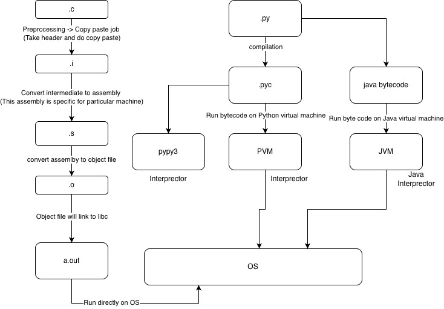

# Day1: Understanding how python works behind the scene?

## Compilation steps on C 
When we compile C program it takes multiple steps 

Command: `gcc -save-temps hello.`
```c
#include <stdio.h>
int main()
{
    printf("Hello world\n");
    return 0;
}
```
- Stage1 (Preprocessing): Compilation pre processing -> Here it does a copy paste job, takes all the headfile content and paste it, also it takes and #define and paste it, hello.c -> hello.i
- Stage2 (Proper): Intermediate file will be check with any syntax error. if no error then intermediate file will be converted into assembly code, hello.i -> hello.s 
- Stage3 (Assembler): Assembly code is converted into object file, which is nothig but the binary version of my hello.s, but this cannot be executed because OS don't know how to execute this, hello.s -> hello.o
- Stage4 (Linking): The object file will be linked with libc (library C), this libc contains the definition of the `printf`. This stage generates the binary file with name `a.out`. This file can be executed `./a.out` 

To check what are linked library use `ldd` command 
```bash
ldd a.out
	linux-vdso.so.1 (0x0000efa4cfb65000)
	libc.so.6 => /lib/aarch64-linux-gnu/libc.so.6 (0x0000efa4cf930000)
	/lib/ld-linux-aarch64.so.1 (0x0000efa4cfb20000)
```

> Note: other vdso and ld libraries linked are supporting library to execute a.out in OS

**Summary:**
C program -> Pre processing (Copy paste) -> Proper (Syntax) -> assembler (ASM) -> Linker -> Binary

hello.c -> hello.i -> hello.s -> hello.o -> a.out 

## How to install python3, jython and pypy3 in Ubuntu 
```bash
# cpython interpretor (PVM) - implemented using C 
sudo apt install python3 
sudo apt install jython # java interpretor (JVM)
sudo apt install pypy3 # 
```

## How python works
Unlike C program which needs a compiler called `gcc`, python needs an interpretor which is nothing but `python3` which is both compiler and interpretor 

Python will be compiled in two stages 
- Stage1: Python code will be converted into byte code, hello.py -> hello.pyc 
- Stage2: Byte code will run on Python interpreter, intern python interpretor execute this code on OS (Operating system)

There are many interpreter 
- PVM (CPython): This is Python Virtual Machine which is developed using C program so it is called as CPython, executed using `python3 hello.py` by default, python3 uses CPython which is simply a `python3`
Ex: `python3 hello.py`

- JVM (jython): jython takes the python code and generated JAVA byte code instead of Python Byte code, So that this can be executed using java, and it runs on Java Virtual Machine.
Ex: `jython hello.py`

- pypy3: This is the optimized version of CPython which is developed using RPython. This does an optimization. In pratical, no one uses this 
Ex: `pypy3 hello.py`

> Note: Use only `python3`, `jython` and `pypy3` is just for understanding purpose only.

### More details on it
#### Cpython uses interpretor from C
Python code -> ByteCode -> Interpreted instruction-by-instruction

```bash
python3 -m compileall hello.py
cd __pycache__
# hello.cpython-312.pyc
# hello -> name of the module 
# cpython -> Interpretor 
# 312 -> version of python
# pyc -> python byte code 
python3 hello.cpython-312.pyc

# To enable verbose 
python3 -v -m compileall hello.py

file hello.cpython-312.pyc
hello.cpython-312.pyc: Byte-compiled Python module for CPython 3.12 or newer, timestamp-based, .py timestamp: Fri May 22 17:39:46 2026 UTC, .py size: 91 bytes
```

#### Jython uses JVM 
```bash
jython hello.py

jython -m compileall hello.py
Compiling hello.py ...

file  hello\$py.class
hello$py.class: compiled Java class data, version 50.0 (Java 1.6)

java -cp /usr/share/java/jython.jar:. hello\$py
```

#### Pypy3 intepretor (alternative to python interpretor)
```bash
# try to run the pvm bytecode using pypy3 
pypy3 hello.cpython-312.pyc
RuntimeError: Bad magic number in .pyc file

pypy3 -m compileall hello.py
file hello.pypy39.pyc
hello.pypy39.pyc: Byte-compiled Python module for PyPy3.9, timestamp-based, .py timestamp: Fri May 22 17:39:46 2026 UTC, .py size: 91 bytes

# python code 
# Byte code 
# JIT compiler observes hot code
# Converts hot paths into machine code
```
> Note: So PyPy can become much faster for long-running programs.
> 


### How to see the Bytecode instructions using python
```python
def hello():
    print("Hello")

import dis
dis.dis(hello)
```

## Link used during class


- To see the assembly code from C: https://godbolt.org/
- Preview the markdown: https://markdownlivepreview.com/
- Python inventor Guido wiki page: https://en.wikipedia.org/wiki/Guido_van_Rossum
- Python was inspired by ABC programming language: https://en.wikipedia.org/wiki/ABC_(programming_language)
- How ABC program looks: https://homepages.cwi.nl/~steven/abc/types.html
- Download link for python: https://www.python.org/downloads/macos/
- Guidline to use markdown format: https://www.markdownguide.org/cheat-sheet/
- Linux source code to check how git looks: https://github.com/torvalds/linux
- Repo link: https://github.com/bhavithc/python_batch1


