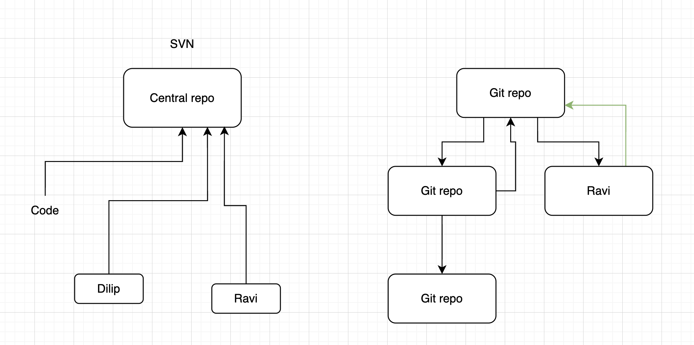

# All about git

There are two types of verioning system for maintaining the source code (programs)
- Centralized versioning system: Here all the source code sits in one single server, and if the server crashes then we are gone, We don't have any backup of the code unless server has a backup setup. Example: SVN is a centralized versioning system 
- Distributed versionin system: Here each person has a complete copy of the source code which is same a server, If server is destroyed we can get back all the source code from the local system. That means each developer has a full git server. 

Companies uses the git and develop the UI on top of it, to make the developer life easy. 

Here are the website which is backed by git and provides the UI for developer to visualize the git 

- Bitbucket: https://bitbucket.org/product/
- Gitlab: https://about.gitlab.com/
- Github: https://github.com/

Here are some of the tools which developer can use in his system (computer) to visualize what is happening in the repo in much intutive way 
- Source tree: https://www.sourcetreeapp.com/
- Gitk: https://www.atlassian.com/git/tutorials/gitk
- Tortoise git: https://tortoisegit.org/
- Vscode git extension

## use full commands 

- To clone the repo `git clone git@github.com:bhavithc/python_batch1.git`
- To see from where I cloned ? `git remote -v`  
- Day1 folder is added to staged area `git add Day1`
- You can see the status of the git any time `git status`
- To check the commit messages `git log`
- To check only 1 message, if you give 2 then it shows last two commit messages `git log -1`

> Note: 
> Difference between fetch and clone?
> - **git clone:** Used to download an entire repository from a remote server for the first time. It creates a new directory, copies all files, history, and branches, and automatically sets up a connection to the original remote repository.
> - **git fetch:** Used after you already have a repository on your machine. It downloads the latest updates (commits, tags, and new branches) from the remote server but does not change your local work. It essentially lets you "see" what others have done without merging it into your files yet

